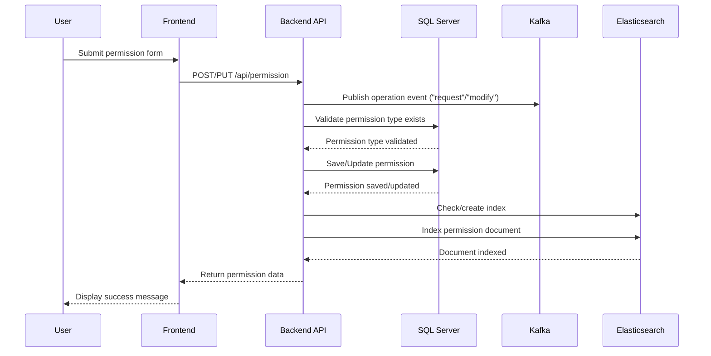
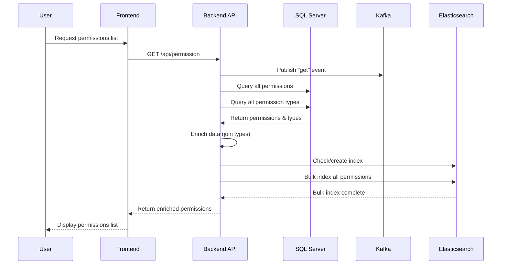
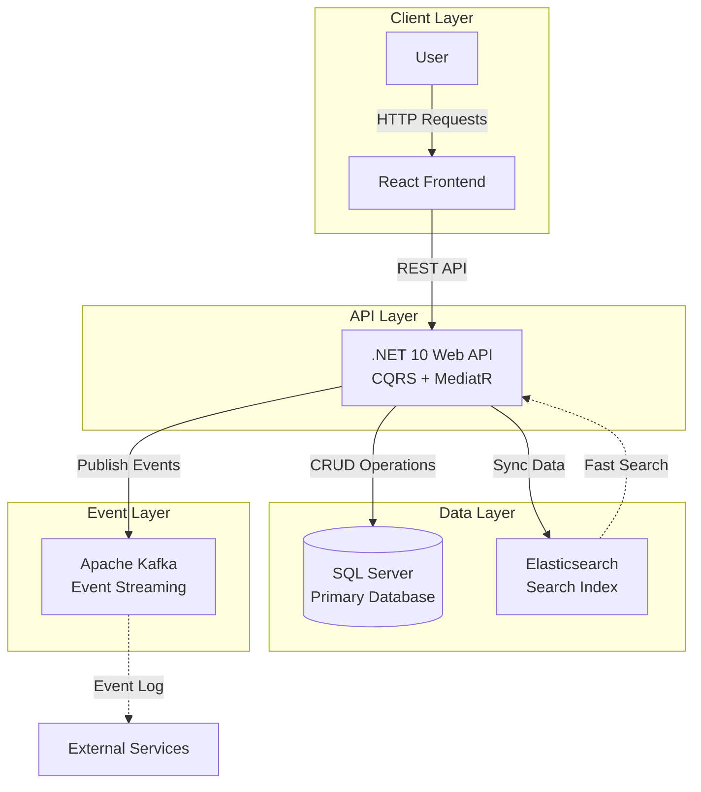

# N5 Project

A .NET 10 application with Elasticsearch and Kafka integration for permission management.

## Overview

This application is a **Permission Management System** that allows organizations to manage employee permissions efficiently. The system follows a modern microservices architecture with clear separation of concerns.

### Application Architecture

**Backend (Web API - .NET 10):**
- **Primary Database (SQL Server)**: Stores all permission data persistently
  - `Permissions` table: Employee permission records (ID, Employee Name, Employee Last Name, Permission Type, Permission Date)
  - `PermissionTypes` table: Available permission types (ID, Description)
- **Elasticsearch Integration**: 
  - Automatically synchronizes permission data for fast search and analytics
  - Creates and maintains the `n5elastic` index
  - Indexes permissions when they are retrieved, created, or modified
  - Enables full-text search capabilities on employee names and permission data
- **Kafka Integration**:
  - Logs all operations for audit and event tracking
  - Publishes events to the `n5kafka` topic for each operation:
    - `"get"` - When retrieving permissions
    - `"request"` - When creating a new permission
    - `"modify"` - When updating an existing permission
  - Enables event-driven architecture and real-time monitoring
- **CQRS Pattern**: Uses MediatR for command/query separation
- **RESTful API**: Provides endpoints for:
  - `GET /api/permission` - Retrieve all permissions (syncs to Elasticsearch)
  - `POST /api/permission` - Create new permission (logs to Kafka, syncs to Elasticsearch)
  - `PUT /api/permission` - Update permission (logs to Kafka, syncs to Elasticsearch)
  - `GET /api/permissionType` - Retrieve all permission types
  - `POST /api/permissionType` - Create new permission type

**Frontend (React + Vite):**
- Modern React application built with Vite for fast development and optimized builds
- Material-UI components for a polished user interface
- React Router for navigation between pages (Get, Create, Modify)
- User interface for managing permissions
- Consumes the REST API endpoints
- Displays permission lists, forms for creating/editing permissions
- Real-time updates and validation

### Data Flow

1. **Create/Update Permission Flow**:
   - User submits permission data via frontend → Backend API
   - Backend validates permission type exists in SQL Server
   - Backend saves/updates data in SQL Server (primary storage)
   - Backend publishes operation event to Kafka (audit trail)
   - Backend synchronizes data to Elasticsearch (search index)

2. **Retrieve Permissions Flow**:
   - User requests permissions via frontend → Backend API
   - Backend publishes "get" event to Kafka (audit trail)
   - Backend retrieves data from SQL Server
   - Backend synchronizes all permissions to Elasticsearch (bulk sync)
   - Backend returns enriched data (with permission type descriptions) to frontend

3. **Search/Analytics Flow**:
   - Elasticsearch provides fast search capabilities on indexed permission data
   - Kafka events can be consumed by other services for real-time monitoring, analytics, or event-driven workflows

### Sequence Diagrams

#### Create/Update Permission Flow



#### Retrieve Permissions Flow



#### System Architecture Overview



## Prerequisites

- .NET 10 SDK
- Docker (for SQL Server, Elasticsearch, Kafka, and Frontend)
- Node.js 20+ and npm (for React frontend development)

## Running SQL Server with Docker

> **Note:** If you already have a SQL Server instance running (either locally or in another Docker container), you can skip this section and proceed to [Database Setup](#database-setup). The `docker-compose.yml` file does not include SQL Server to avoid port conflicts.

### Option 1: Using Docker Compose (Optional)

If you want to add SQL Server to your `docker-compose.yml`, add this service:

```yaml
  sqlserver:
    image: mcr.microsoft.com/mssql/server:2022-latest
    container_name: n5-sqlserver
    environment:
      - ACCEPT_EULA=Y
      - SA_PASSWORD=StrongPassword123!
      - MSSQL_PID=Express
    ports:
      - "1433:1433"
    volumes:
      - sqlserver_data:/var/opt/mssql
      - ./N5.Scripts:/docker-entrypoint-initdb.d
    networks:
      - n5-network
```

Run with:
```bash
docker compose up -d sqlserver
```

### Option 2: Using Docker Run

```bash
docker run -d \
  --name n5-sqlserver \
  -e "ACCEPT_EULA=Y" \
  -e "SA_PASSWORD=StrongPassword123!" \
  -e "MSSQL_PID=Express" \
  -p 1433:1433 \
  -v sqlserver_data:/var/opt/mssql \
  -v "$(pwd)/N5.Scripts:/docker-entrypoint-initdb.d" \
  mcr.microsoft.com/mssql/server:2022-latest
```

### Verify SQL Server is Running

```bash
# Check if container is running
docker ps | grep n5-sqlserver

# Check logs
docker logs n5-sqlserver

# Connect using sqlcmd (if installed)
sqlcmd -S localhost,1433 -U sa -P "StrongPassword123!" -Q "SELECT @@VERSION"
```

### Create Database and Objects

**If using Docker SQL Server (from this guide):**

**Option A: Using Docker Exec (Recommended)**

1. Copy the database script to the container:
   ```bash
   docker cp N5.Scripts/N5Database.sql n5-sqlserver:/tmp/
   ```

2. Execute the script:
   ```bash
   docker exec -it n5-sqlserver /opt/mssql-tools18/bin/sqlcmd \
     -S localhost -U sa -P "StrongPassword123!"   -C \
     -i /tmp/N5Database.sql
   ```

**Option B: Using SQL Server Management Studio (SSMS) or Azure Data Studio**

1. Connect to SQL Server:
   - Server: `localhost,1433`
   - Authentication: SQL Server Authentication
   - Login: `sa`
   - Password: `StrongPassword123!`

2. Execute the script `N5.Scripts/N5Database.sql`

**Option C: Using sqlcmd locally**

```bash
sqlcmd -S localhost,1433 -U sa -P "StrongPassword123!" -i N5.Scripts/N5Database.sql
```

**If using an existing SQL Server instance:**

1. Connect to your SQL Server (using SSMS, Azure Data Studio, or sqlcmd)
2. Execute the script `N5.Scripts/N5Database.sql`
3. Update the connection string in `N5.WebApi/appsettings.json` with your SQL Server details

### Configuration

Update `N5.WebApi/appsettings.json` with the appropriate connection string:

**For Docker SQL Server:**
```json
"ConnectionStrings": {
  "N5DB": "Server=localhost,1433;Database=N5;User Id=sa;Password=StrongPassword123!;TrustServerCertificate=True;"
}
```

**For existing SQL Server (Windows Authentication):**
```json
"ConnectionStrings": {
  "N5DB": "Server=YOUR_SERVER\\SQLEXPRESS;Database=N5;Trusted_Connection=True;"
}
```

**For existing SQL Server (SQL Authentication):**
```json
"ConnectionStrings": {
  "N5DB": "Server=YOUR_SERVER,1433;Database=N5;User Id=YOUR_USER;Password=YOUR_PASSWORD;TrustServerCertificate=True;"
}
```

> **Security Note:** Change the default password in production! The default password `StrongPassword123!` should be replaced with a strong password.

## Running Elasticsearch with Docker

### Option 1: Using Docker Compose (Recommended)

Create a `docker-compose.yml` file in the project root:

```yaml
services:
  elasticsearch:
    image: docker.elastic.co/elasticsearch/elasticsearch:9.2.4
    container_name: n5-elasticsearch
    environment:
      - discovery.type=single-node
      - xpack.security.enabled=true
      - ELASTIC_PASSWORD=migusanv
      - "ES_JAVA_OPTS=-Xms512m -Xmx512m"
    ports:
      - "9200:9200"
      - "9300:9300"
    volumes:
      - elasticsearch_data:/usr/share/elasticsearch/data
    networks:
      - n5-network

volumes:
  elasticsearch_data:

networks:
  n5-network:
    driver: bridge
```

Run with:
```bash
docker compose up -d elasticsearch
```

### Option 2: Using Docker Run

```bash
docker run -d \
  --name n5-elasticsearch \
  -p 9200:9200 \
  -p 9300:9300 \
  -e "discovery.type=single-node" \
  -e "xpack.security.enabled=true" \
  -e "ELASTIC_PASSWORD=migusanv" \
  -e "ES_JAVA_OPTS=-Xms512m -Xmx512m" \
  docker.elastic.co/elasticsearch/elasticsearch:9.2.4
```

### Verify Elasticsearch is Running

```bash
curl -u elastic:migusanv http://localhost:9200
```

Or visit: http://localhost:9200 (username: `elastic`, password: `migusanv`)

### Configuration

Update `N5.WebApi/appsettings.json`:
```json
"ElasticSearch": {
  "Host": "http://127.0.0.1",
  "Port": "9200",
  "Username": "elastic",
  "Password": "migusanv",
  "Indexname": "n5elastic"
}
```

## Running Kafka with Docker

Kafka is configured to use **KRaft mode** (Kafka Raft).

### Option 1: Using Docker Compose (Recommended)

Add to your `docker-compose.yml`:

```yaml
  kafka:
    image: confluentinc/cp-kafka:latest
    container_name: n5-kafka
    ports:
      - "9092:9092"
    environment:
      KAFKA_PROCESS_ROLES: broker,controller
      KAFKA_NODE_ID: 1
      KAFKA_CONTROLLER_QUORUM_VOTERS: 1@localhost:9093
      KAFKA_LISTENERS: PLAINTEXT://0.0.0.0:9092,CONTROLLER://0.0.0.0:9093
      KAFKA_ADVERTISED_LISTENERS: PLAINTEXT://localhost:9092
      KAFKA_INTER_BROKER_LISTENER_NAME: PLAINTEXT
      KAFKA_CONTROLLER_LISTENER_NAMES: CONTROLLER
      KAFKA_LISTENER_SECURITY_PROTOCOL_MAP: CONTROLLER:PLAINTEXT,PLAINTEXT:PLAINTEXT
      KAFKA_OFFSETS_TOPIC_REPLICATION_FACTOR: 1
      KAFKA_TRANSACTION_STATE_LOG_REPLICATION_FACTOR: 1
      KAFKA_TRANSACTION_STATE_LOG_MIN_ISR: 1
      KAFKA_AUTO_CREATE_TOPICS_ENABLE: true
      CLUSTER_ID: MkU3OEVBNTcwNTJENDM2Qk
    volumes:
      - kafka_data:/var/lib/kafka/data
    networks:
      - n5-network
```

Run with:
```bash
docker compose up -d kafka
```

### Option 2: Using Docker Run

```bash
docker run -d \
  --name n5-kafka \
  -p 9092:9092 \
  -e KAFKA_PROCESS_ROLES=broker,controller \
  -e KAFKA_NODE_ID=1 \
  -e KAFKA_CONTROLLER_QUORUM_VOTERS=1@localhost:9093 \
  -e KAFKA_LISTENERS=PLAINTEXT://0.0.0.0:9092,CONTROLLER://0.0.0.0:9093 \
  -e KAFKA_ADVERTISED_LISTENERS=PLAINTEXT://localhost:9092 \
  -e KAFKA_INTER_BROKER_LISTENER_NAME=PLAINTEXT \
  -e KAFKA_CONTROLLER_LISTENER_NAMES=CONTROLLER \
  -e KAFKA_LISTENER_SECURITY_PROTOCOL_MAP=CONTROLLER:PLAINTEXT,PLAINTEXT:PLAINTEXT \
  -e KAFKA_OFFSETS_TOPIC_REPLICATION_FACTOR=1 \
  -e KAFKA_TRANSACTION_STATE_LOG_REPLICATION_FACTOR=1 \
  -e KAFKA_TRANSACTION_STATE_LOG_MIN_ISR=1 \
  -e KAFKA_AUTO_CREATE_TOPICS_ENABLE=true \
  -e CLUSTER_ID=MkU3OEVBNTcwNTJENDM2Qk \
  -v kafka_data:/var/lib/kafka/data \
  confluentinc/cp-kafka:latest
```

### Verify Kafka is Running

```bash
# List topics
docker exec -it n5-kafka kafka-topics --list --bootstrap-server localhost:9092

# Create topic (if needed)
docker exec -it n5-kafka kafka-topics --create --topic n5kafka --bootstrap-server localhost:9092 --partitions 1 --replication-factor 1

# Consume messages
docker exec -it n5-kafka kafka-console-consumer --bootstrap-server localhost:9092 --topic n5kafka --from-beginning
```

### Configuration

Update `N5.WebApi/appsettings.json`:
```json
"Kafka": {
  "Host": "localhost:9092",
  "Topic": "n5kafka"
}
```

## Complete Docker Compose Setup

The `docker-compose.yml` file includes Elasticsearch, Kafka (using KRaft mode), Web API, and Frontend services. **Note:** SQL Server is not included as it should be running separately or you may already have an existing SQL Server instance.

```yaml
services:
  elasticsearch:
    image: docker.elastic.co/elasticsearch/elasticsearch:9.2.4
    container_name: n5-elasticsearch
    environment:
      - discovery.type=single-node
      - xpack.security.enabled=true
      - ELASTIC_PASSWORD=migusanv
      - "ES_JAVA_OPTS=-Xms512m -Xmx512m"
    ports:
      - "9200:9200"
      - "9300:9300"
    volumes:
      - elasticsearch_data:/usr/share/elasticsearch/data
    networks:
      - n5-network
    healthcheck:
      test: ["CMD-SHELL", "curl -u elastic:migusanv http://localhost:9200 || exit 1"]
      interval: 10s
      timeout: 5s
      retries: 5

  kafka:
    image: confluentinc/cp-kafka:latest
    container_name: n5-kafka
    ports:
      - "9092:9092"
    environment:
      KAFKA_PROCESS_ROLES: broker,controller
      KAFKA_NODE_ID: 1
      KAFKA_CONTROLLER_QUORUM_VOTERS: 1@localhost:9093
      KAFKA_LISTENERS: PLAINTEXT://0.0.0.0:9092,CONTROLLER://0.0.0.0:9093
      KAFKA_ADVERTISED_LISTENERS: PLAINTEXT://localhost:9092
      KAFKA_INTER_BROKER_LISTENER_NAME: PLAINTEXT
      KAFKA_CONTROLLER_LISTENER_NAMES: CONTROLLER
      KAFKA_LISTENER_SECURITY_PROTOCOL_MAP: CONTROLLER:PLAINTEXT,PLAINTEXT:PLAINTEXT
      KAFKA_OFFSETS_TOPIC_REPLICATION_FACTOR: 1
      KAFKA_TRANSACTION_STATE_LOG_REPLICATION_FACTOR: 1
      KAFKA_TRANSACTION_STATE_LOG_MIN_ISR: 1
      KAFKA_AUTO_CREATE_TOPICS_ENABLE: true
      CLUSTER_ID: MkU3OEVBNTcwNTJENDM2Qk
    volumes:
      - kafka_data:/var/lib/kafka/data
    networks:
      - n5-network
    healthcheck:
      test: ["CMD-SHELL", "kafka-broker-api-versions --bootstrap-server localhost:9092 || exit 1"]
      interval: 10s
      timeout: 5s
      retries: 5

volumes:
  elasticsearch_data:
  kafka_data:

networks:
  n5-network:
    driver: bridge
```

### Starting Services

**Start all services (Elasticsearch, Kafka, Web API, and Frontend):**
```bash
docker compose up -d --build
```

**Start only specific services:**
```bash
# Start only Elasticsearch and Kafka
docker compose up -d elasticsearch kafka

# Start Web API and Frontend (after Elasticsearch and Kafka are running)
docker compose up -d webapi frontend
```

**Stop all services:**
```bash
docker compose down
```

**Stop and remove volumes (⚠️ This will delete all data):**
```bash
docker compose down -v
```

**View logs:**
```bash
# All services
docker compose logs -f

# Specific service
docker compose logs -f frontend
docker compose logs -f webapi
```

### Initial Setup Steps

1. **Ensure SQL Server is running:**
   - If you have an existing SQL Server container, make sure it's running on port `1433`
   - If you need to create a new SQL Server container, see the [Running SQL Server with Docker](#running-sql-server-with-docker) section above
   - Verify SQL Server is accessible:
     ```bash
     docker ps | grep sqlserver
     # or
     sqlcmd -S localhost,1433 -U sa -P "YourPassword" -Q "SELECT @@VERSION"
     ```

2. **Create the database** (if not already created):
   - Connect to your SQL Server instance
   - Execute the script `N5.Scripts/N5Database.sql`
   - See the [Database Setup](#database-setup) section for detailed instructions

3. **Start all services:**
   ```bash
   docker compose up -d --build
   ```

4. **Wait for services to be ready:**
   ```bash
   # Check Elasticsearch
   curl -u elastic:migusanv http://localhost:9200
   
   # Check Kafka
   docker exec -it n5-kafka kafka-topics --list --bootstrap-server localhost:9092
   
   # Check Web API
   curl http://localhost:8080/swagger
   
   # Check Frontend
   curl http://localhost:3000
   ```

5. **Verify all services are running:**
   ```bash
   docker ps
   ```
   You should see: `n5-elasticsearch`, `n5-kafka`, `n5-webapi`, and `n5-frontend` (plus your SQL Server container if running in Docker)

6. **Access the application:**
   - Frontend: [http://localhost:3000](http://localhost:3000)
   - API: [http://localhost:8080](http://localhost:8080)
   - Swagger: [http://localhost:8080/swagger](http://localhost:8080/swagger)

## Running the Application

### Backend (Web API)

#### Option 1: Running Locally (Development)

1. Open the solution `N5.sln` in Visual Studio or your preferred IDE
2. Set `N5.WebApi` as the startup project
3. Run the application (F5 or `dotnet run`)

The API will be available at the configured port (usually `https://localhost:5001` or `http://localhost:5000`)

#### Option 2: Running with Docker

**Build the Docker image:**
```bash
# From the project root directory
docker build -f N5.WebApi/Dockerfile -t n5-webapi .
```

**Run the container (Option A - Join the n5-network):**

**First, add SQL Server to the n5-network (if not already connected):**
```bash
docker network connect n5_n5-network sqlserver
```

**Then run the webapi container:**
```bash
docker run -d \
  --name n5-webapi \
  --network n5_n5-network \
  -p 8080:80 \
  -p 8443:443 \
  -e ASPNETCORE_ENVIRONMENT=Development \
  -e ASPNETCORE_URLS=http://+:80 \
  -e 'ConnectionStrings__N5DB=Server=sqlserver,1433;Database=N5;User Id=sa;Password=StrongPassword123!;TrustServerCertificate=True;' \
  -e ElasticSearch__Host="http://n5-elasticsearch" \
  -e ElasticSearch__Port="9200" \
  -e ElasticSearch__Username="elastic" \
  -e ElasticSearch__Password="migusanv" \
  -e Kafka__Host="n5-kafka:9092" \
  n5-webapi
```

**Run the container (Option B - Use host.docker.internal):**
```bash
docker run -d \
  --name n5-webapi \
  -p 8080:80 \
  -p 8443:443 \
  -e ASPNETCORE_ENVIRONMENT=Development \
  -e ASPNETCORE_URLS=http://+:80 \
  -e ConnectionStrings__N5DB="Server=host.docker.internal,1433;Database=N5;User Id=sa;Password=StrongPassword123!;TrustServerCertificate=True;" \
  -e ElasticSearch__Host="http://host.docker.internal" \
  -e ElasticSearch__Port="9200" \
  -e ElasticSearch__Username="elastic" \
  -e ElasticSearch__Password="migusanv" \
  -e Kafka__Host="host.docker.internal:9092" \
  n5-webapi
```

**Note:** 
- **Option A** is recommended if your Elasticsearch and Kafka containers are in the `n5-network` (from docker-compose.yml)
- **Option B** works if the containers are running on the host machine
- Replace `StrongPassword123!` with your actual SQL Server password if different

**Or using Docker Compose (already included in `docker-compose.yml`):**

The `docker-compose.yml` file includes both `webapi` and `frontend` services:

```yaml
  webapi:
    build:
      context: .
      dockerfile: N5.WebApi/Dockerfile
    container_name: n5-webapi
    ports:
      - "8080:80"
      - "8443:443"
    environment:
      - ASPNETCORE_ENVIRONMENT=Development
      - ASPNETCORE_URLS=http://+:80
      - ConnectionStrings__N5DB=Server=sqlserver,1433;Database=N5;User Id=sa;Password=StrongPassword123!;TrustServerCertificate=True;
      - ElasticSearch__Host=http://n5-elasticsearch
      - ElasticSearch__Port=9200
      - ElasticSearch__Username=elastic
      - ElasticSearch__Password=migusanv
      - Kafka__Host=n5-kafka:9092
    depends_on:
      - elasticsearch
      - kafka
    networks:
      - n5-network

  frontend:
    build:
      context: ./N5.Presentation
      dockerfile: Dockerfile
      args:
        VITE_API_END_POINT: http://n5-webapi:80
    container_name: n5-frontend
    ports:
      - "3000:80"
    depends_on:
      - webapi
    networks:
      - n5-network
```

**Note:** 
- When running in Docker, use container names (e.g., `sqlserver`, `n5-elasticsearch`, `n5-kafka`, `n5-webapi`) when containers are in the same network, or `host.docker.internal` (Windows/Mac only) for services on the host
- **Important for WSL/Linux:** `host.docker.internal` doesn't work in Linux/WSL. You must connect SQL Server to the same network (`docker network connect n5_n5-network sqlserver`) and use the container name (`sqlserver`) in the connection string
- The API will be available at `http://localhost:8080` (HTTP) and `https://localhost:8443` (HTTPS)
- The Frontend will be available at `http://localhost:3000`
- Swagger UI is available at `http://localhost:8080/swagger` (only in Development mode)

### Frontend (React + Vite Application)

#### Option 1: Running Locally (Development)

1. Navigate to the `N5.Presentation` folder:
   ```bash
   cd N5.Presentation
   ```

2. Install dependencies (if not already installed):
   ```bash
   npm install
   ```

3. Update the environment configuration file `N5.Presentation/environments/.dev.env` if needed:
   ```env
   VITE_API_END_POINT=http://localhost:8080
   ```

4. Start the development server:
   ```bash
   npm run dev
   ```
   
   For local environment (port 5000):
   ```bash
   npm run dev:local
   ```

5. Open [http://localhost:5173](http://localhost:5173) in your browser

**Note:** Vite uses port `5173` by default (not 3000 like Create React App)

#### Option 2: Running with Docker

**Using Docker Compose (Recommended):**

The `docker-compose.yml` includes a frontend service. To start all services including the frontend:

```bash
docker compose up -d --build
```

The frontend will be available at [http://localhost:3000](http://localhost:3000)

**Build the Docker image manually:**

```bash
# From the N5.Presentation directory
docker build -t n5-frontend .
```

**Run the container:**

```bash
docker run -d \
  --name n5-frontend \
  -p 3000:80 \
  --network n5_n5-network \
  n5-frontend
```

**Environment Variables for Docker:**

The frontend Dockerfile accepts a build argument for the API endpoint:

```bash
docker build \
  --build-arg VITE_API_END_POINT=http://n5-webapi:80 \
  -t n5-frontend \
  ./N5.Presentation
```

**Note:** 
- When running in Docker, the frontend connects to the API using the Docker service name (`n5-webapi`)
- The frontend is served via Nginx in production mode
- For development, use `npm run dev` locally

## Database Reset Scripts

If you need to reset the database:

```sql
DELETE FROM PermissionTypes;
DELETE FROM Permissions;
DBCC CHECKIDENT (PermissionTypes, RESEED, 0);
DBCC CHECKIDENT (Permissions, RESEED, 0);
```

## Project Structure

```
N5/
├── N5.Application/          # Application layer (CQRS, MediatR)
├── N5.Domain/               # Domain entities and mappings
├── N5.Infrastructure/       # Infrastructure (Repositories, Services)
├── N5.WebApi/               # Web API (Controllers, Startup)
├── N5.Presentation/         # React frontend
├── N5.Test/                 # Unit tests
└── N5.Scripts/              # Database scripts
```

## Technologies Used

### Backend
- **.NET 10** - Backend framework
- **Entity Framework Core 10** - ORM
- **MediatR** - CQRS pattern implementation
- **Elasticsearch 9.2.4** - Search and analytics engine
- **Apache Kafka** - Event streaming platform
- **SQL Server** - Database

### Frontend
- **React 19** - Frontend framework
- **Vite 6** - Build tool and development server
- **Material-UI (MUI) 6** - UI component library
- **React Router 7** - Client-side routing
- **Axios** - HTTP client for API requests
- **Nginx** - Web server for production builds (Docker)

## Screenshots


## Verifying Services

### Verifying Kafka is Working

**1. List all Kafka topics:**
```bash
docker exec -it n5-kafka kafka-topics --bootstrap-server localhost:9092 --list
```

**2. Describe the Kafka topic (verify it exists and see details):**
```bash
docker exec -it n5-kafka kafka-topics \
  --bootstrap-server localhost:9092 \
  --describe \
  --topic n5kafka
```

**3. Consume messages from Kafka in real-time:**
```bash
docker exec -it n5-kafka kafka-console-consumer \
  --bootstrap-server localhost:9092 \
  --topic n5kafka \
  --from-beginning
```

**4. Check message count in the topic:**
```bash
docker exec -it n5-kafka kafka-run-class kafka.tools.GetOffsetShell \
  --broker-list localhost:9092 \
  --topic n5kafka
```

**To test Kafka integration:**
1. Open a terminal and run the consumer (step 3 above)
2. Make an API request (e.g., `GET http://localhost:8080/api/permissionType`)
3. You should see a JSON message in the consumer showing the operation that was logged

### Verifying Elasticsearch is Working

**1. Check Elasticsearch cluster health:**
```bash
curl -u elastic:migusanv http://localhost:9200/_cluster/health?pretty
```

**2. List all indices:**
```bash
curl -u elastic:migusanv http://localhost:9200/_cat/indices?v
```

**3. Check if the n5elastic index exists:**
```bash
curl -u elastic:migusanv http://localhost:9200/n5elastic?pretty
```

**4. Search documents in the index:**
```bash
curl -u elastic:migusanv http://localhost:9200/n5elastic/_search?pretty
```

## Troubleshooting

### Elasticsearch Connection Issues
- Ensure Elasticsearch container is running: `docker ps`
- Check Elasticsearch logs: `docker logs n5-elasticsearch`
- Verify credentials match `appsettings.json`

### Kafka Connection Issues
- Ensure Kafka container is running: `docker ps | grep n5-kafka`
- Check Kafka logs: `docker logs n5-kafka`
- Verify the topic exists: `docker exec -it n5-kafka kafka-topics --list --bootstrap-server localhost:9092`
- Verify topic details: `docker exec -it n5-kafka kafka-topics --bootstrap-server localhost:9092 --describe --topic n5kafka`
- Check if messages are being produced: Use the consumer command in the "Verifying Services" section above
- If messages aren't appearing, check the webapi logs: `docker logs n5-webapi | grep -i kafka`

### Database Connection Issues
- Ensure SQL Server container is running: `docker ps | grep n5-sqlserver`
- Check SQL Server logs: `docker logs n5-sqlserver`
- Verify connection string in `appsettings.json` matches Docker configuration
- Ensure database and tables are created from scripts
- Wait for SQL Server to be fully ready (check health status)
- On Windows, you might need to use `localhost,1433` instead of `localhost:1433` in connection strings

## License

This project is licensed under the MIT License - see the [LICENSE](LICENSE) file for details.
